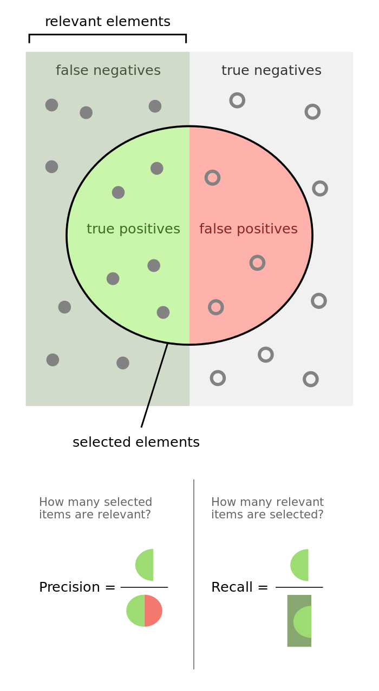

# Default Credit Payment Prediction Project

## Data source
This project is based on an UCI dataset [link here](https://www.kaggle.com/uciml/default-of-credit-card-clients-dataset) containing information on default payments, demographic factors, credit data, history of payment, and bill statements of credit card clients in Taiwan from April 2005 to September 2005.

## Objective

Identify and predict default payments

## Approach

* Conduct an exploratory data analysis to identify patterns

* Benchmark on-shelf machine learning models

* Pick the best models and fine tune them

## Exploratory Data Analysis (eda.ipynb)

Our first step of forecasting default credit payment is to explore what data are available and at which extend. 

The provided metadata along with the dataset are the following. They look at each features and describe what they represent.

* ID: ID of each client
* LIMIT_BAL: Amount of given credit in NT dollars (includes individual and family/supplementary credit
* SEX: Gender (1=male, 2=female)
* EDUCATION: (1=graduate school, 2=university, 3=high school, 4=others, 5=unknown, 6=unknown)
* MARRIAGE: Marital status (1=married, 2=single, 3=others)
* AGE: Age in years
* PAY_0: Repayment status in September, 2005 (-1=pay duly, 1=payment delay for one month, 2=payment delay for two months, ... 8=payment delay for eight months, 9=payment delay for nine months and above)
* PAY_2: Repayment status in August, 2005 (scale same as above)
* PAY_3: Repayment status in July, 2005 (scale same as above)
* PAY_4: Repayment status in June, 2005 (scale same as above)
* PAY_5: Repayment status in May, 2005 (scale same as above)
* PAY_6: Repayment status in April, 2005 (scale same as above)
* BILL_AMT1: Amount of bill statement in September, 2005 (NT dollar)
* BILL_AMT2: Amount of bill statement in August, 2005 (NT dollar)
* BILL_AMT3: Amount of bill statement in July, 2005 (NT dollar)
* BILL_AMT4: Amount of bill statement in June, 2005 (NT dollar)
* BILL_AMT5: Amount of bill statement in May, 2005 (NT dollar)
* BILL_AMT6: Amount of bill statement in April, 2005 (NT dollar)
* PAY_AMT1: Amount of previous payment in September, 2005 (NT dollar)
* PAY_AMT2: Amount of previous payment in August, 2005 (NT dollar)
* PAY_AMT3: Amount of previous payment in July, 2005 (NT dollar)
* PAY_AMT4: Amount of previous payment in June, 2005 (NT dollar)
* PAY_AMT5: Amount of previous payment in May, 2005 (NT dollar)
* PAY_AMT6: Amount of previous payment in April, 2005 (NT dollar)
* default.payment.next.month: Default payment (1=yes, 0=no)

After loading the dataset, we will look at our data structure, data types, null values. Then, we will try to find any relationship
between our features. The final step will be to plot some of our data at different angles.

## Modeling (modeling.ipynb)

This step consists in trying to find the best model which can predict our target value (default credit payment the following month). 
As we have seen during our EDA, we still need to do some data engineering in order to deal with categorical features and rescale the 
numerical features. Once the data engineering is done, we will take the following pragmatic approach :
1. Select list of known classification models
* Run a baseline model for each of our pre-selected models
* Pick the top models base on a specific score (recall score / f1 score in our case)
* Tune the hyper-parameters of the top models and watch score increase

So below is the list of pre-selected classification models :

* Logistic Regression
* Decision Tree
* Random Forest
* AdaBoost
* K Nearest Neighbors
* XGBoost
* SVC (Support Vector Classification)

In order to compare their performances, we need to define a which scoring metrics we are going to use. As we try to find out if
the credit payment status (paid or not paid the following month), it is important to catch as much as possible the ones that are 
positive (not paid => target value = 1). Or in other words, we will try to minimise the **False Positive** classifications (paid status predicted when the actual status is not paid). This is exactly the **Recall score** definition. Also, we want to keep our accuracy high
**True Negative + True Positive** observations. See below a visual definition 

**Recall, Precision and F1-score Formulas**:

$Recall = \frac{TP}{TP + FN}$

$Precision = \frac{TP}{TP + FP}$

$F1 = 2 * \frac{Recall * Precision}{Recall + Precision}$

## Conclusion

As seen above our best performing models to predict the target value (default credit payment status) are Logistoc Regression
model and AdaBoost model. We have also seen that dealing with imbalance dataset (using SMOTE) improved significantly our
models performances. 
Nonetheless, neither Logistic Regression nor AdaBoost are great model predictors with an estimated recall score around .6 just 
above random guess. May be more features around individuals might help.
Another conclusion could also be that the unpredictable.